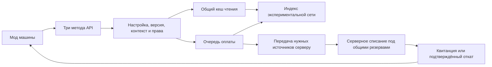

# Проект API RunicStorageNetwork

**Статус: предложение для согласования. Реализация не начата.**

Редакция 2, 29 сентября 2026 года: уточнены владение и восстановление оплаты, границы ответственности интеграции, частичные снимки и ограничения нагрузки после проверки проекта. Дополнительно закреплено требование сначала автоматически исправлять сбои сети и только затем завершать попытку отказом. Это решения для будущей реализации, а не подтверждение исправлений в работающем моде.

Основание: RunicStorageNetwork **0.8.7**, коммит `1ca959bbc0cc4bbc1c743d8de83a02ccc68d9bb5`. Документ подготовлен по текущему коду; описанные ниже новые типы, методы, статусы и гарантии ещё не существуют в моде.

## 1. Решение, которое фиксируем

API предоставляет другим модам ровно три операции:

1. Получить список ресурсов сети — `GetResources`.
2. Получить количество конкретного ресурса — `GetResourceAmount`.
3. Списать ресурсы и получить подтверждение — `TryConsumeResources`.

Третья операция соответствует исходной идее **Give Resource**. Название уточняет направление: ресурсы списываются из сети, после чего машина может использовать подтверждённую оплату. Метод не помещает новый предмет в инвентарь машины.

**Новые чтения и новые списания доступны только при работающей экспериментальной функции `ExperimentalUnloadedNetworks`.** Даже если нужный сундук находится рядом, выключенная функция даёт `FeatureDisabled`. Единственное исключение — восстановление результата ранее принятой оплаты и её безопасное завершение: это не новое использование сети. Перехода на обычную систему снабжения через API нет.

API использует индекс, обнаружение удалённой сети, владельцев инвентарей и механизм списания RSN. Отдельную копию содержимого мира и отдельную систему списания не создаём. При переводе экспериментальной функции в полноценный режим публичные методы сохраняются.

Обязательные требования пользователя — три операции, зависимость от экспериментальной функции и небольшая нагрузка. Конкретные сигнатуры, рамки первой версии и численные лимиты далее являются предлагаемым решением, подлежащим утверждению.

**Восстановление до отказа — обязательное поведение.** Устаревшая привязка к сети, недостоверные остатки, временно недоступный сундук или потерянное подтверждение сначала запускают адресную перепроверку и автоматическое восстановление. Мод-потребитель не должен заставлять игрока перестраивать сеть или отлаживать обычный сетевой сбой. Повтор оплаты без знания исхода предыдущей попытки при этом запрещён.

## 2. Что уже есть в коде и чего не хватает

| Текущий код | Что можно использовать | Что нужно изменить для API |
| --- | --- | --- |
| [ResourceCatalog.cs](src/ResourceCatalog.cs) | Индекс «предмет → хранилища», версии содержимого, защита от старых записей предыдущего владельца | Дать доступ внутреннему сервису чтения без раскрытия изменяемых `Stock` наружу |
| [StorageIndex.cs](src/StorageIndex.cs), [UnloadedStorageIndex.cs](src/UnloadedStorageIndex.cs) | Обновление затронутых инвентарей, индексированная выборка, работа по потребности | Общий агрегированный снимок для сети и прав доступа; чтение без повторного обхода `core.Pool` |
| [UnloadedNetworks.cs](src/UnloadedNetworks.cs) | Каталог сохранённых объектов, поиск сети без посещения ядра, облегчённые адаптеры сундуков | Запрос от машины, ограниченная подготовка холодного каталога, учёт активных операций |
| [UnloadedMultiplayer.cs](src/UnloadedMultiplayer.cs) | Проверка запросов сервером, дозированная доставка сведений | Сейчас запрос привязан к персонажу и точке рядом с ним; нужен контекст потребителя |
| [Planner.cs](src/Planner.cs), [SourceGate.cs](src/SourceGate.cs) | План списания нескольких ресурсов, выбор меньшего числа источников, взаимное исключение | Использовать для машин совместно с обычным крафтом, не заводить независимые блокировки |
| [Transport.cs](src/Transport.cs), `InventoryDelta` в [Core.cs](src/Core.cs) | Получение свежих остатков у владельцев, списание, компенсация и повторные подтверждения | Новый вид операции; окончательный результат списания без запуска рецепта игрока |
| [TerminalTransfer.cs](src/TerminalTransfer.cs) | Пример сетевого изъятия и защиты от повторной доставки | Нельзя просто открыть `Start()` наружу: он требует игрока, кодекс и открытое окно; используется один общий `pending` |
| [Recovery.cs](src/Recovery.cs) | Квитанции результатов внутри сеанса | Для частых запросов машин нужна ограниченная память и явно определённое повторение запросов |

Дополнительные ограничения текущего кода:

- `StorageIndex.Browse()` проходит по сундукам сети и проверяет доступ. Это не готовый дешёвый публичный вызов для десятков машин каждый кадр.
- `StorageIndex.Ready()` проверяет уже известный пул. Пустой или неполный пул сам по себе не доказывает, что удалённая сеть обнаружена целиком.
- `Transport.Request()` разрешает одну активную/ожидающую операцию на участника соединения. У одного участника может быть несколько машин; этот лимит нельзя использовать как идентификатор потребителя.
- `UnloadedMultiplayer` хранит наблюдение по участнику соединения и клиентскую точку запроса. Несколько машин нельзя обслуживать перезаписью этой точки.
- `UnloadedNetworks.Prepare()` и `Request()` содержат обходы узлов/секторов. Ограничение создания адаптеров по кадрам не ограничивает автоматически стоимость этих обходов.
- Эксперимент устанавливает патчи при запуске. Настройка сейчас требует полного перезапуска и включения на сервере и клиентах; одного изменения значения в конфиге недостаточно.
- `Transport` удерживает `ended`, `releasedLeases` и окончательные отказы до смены сеанса. Поток автоматических операций нельзя направлять в эти неограниченные истории.
- Ответы существующего транспорта привязаны к исходному участнику соединения, а освобождение резерва — к исходному владельцу сундука. Это не готовое восстановление после смены владельца машины или отключения клиента.
- Истечение наблюдения не удаляет автоматически серверные адаптеры и `requestedChests`. Для API нужен отдельный учёт потребности и безопасное освобождение объектов.

## 3. Публичный контракт

Предлагаемый класс — `RunicStorageNetwork.API.NetworkResources`, версия контракта — `1`. Снимки и DTO неизменяемые, коллекции доступны только для чтения. Объект наблюдения за оплатой меняется внутри API, но потребитель не может изменять его состояние. Публичных операций ровно три; отдельные методы подключения, регистрации, резервирования, подтверждения и отмены в v1 не требуются.

```csharp
ResourceSnapshot GetResources(ApiContext context);

ResourceAmountResult GetResourceAmount(
    ApiContext context,
    ResourceKey resource);

ConsumeOperation TryConsumeResources(
    ApiContext context,
    ConsumeRequest request,
    Action<ConsumeResult> completed = null);
```

Это эскиз контракта, не готовый к компиляции пример. `ConsumeOperation` — объект наблюдения за одной операцией, а не четвёртая точка входа в API.

### Контекст потребителя

`ApiContext` содержит идентификатор сетевого объекта машины (`ConsumerId`, ZDOID) и идентификатор интеграции (`ModId`, GUID плагина BepInEx). Потребитель не передаёт произвольную позицию, имя сети, список сундуков или игрока, от чьего имени можно списывать.

Сервер самостоятельно получает позицию, владельца сетевого объекта и создателя постройки. Сеть выбирается по покрытию в позиции машины по общим правилам RSN; название сети остаётся декоративным.

При устаревшей привязке API заново определяет ядро, связанную компоненту реле, покрытие и права машины. Имя сети не используется для поиска или идентичности оплаты и не переименовывается ради восстановления. При необходимости исправляется внутренний `NetworkId` и маршрут по правилам раздела 7.

Предлагаемая рамка v1: неподвижная постройка с `Piece` и `ZNetView`, размещённая игроком. Новые операции инициирует текущий владелец её сетевого объекта. Для автоматической работы права доступа определяются создателем постройки, которого сервер читает из ZDO. Получение прав произвольного онлайн-игрока не допускается. `ModId` служит для адресации и диагностики, а не является доказательством прав. Серверная часть той же интеграции может повторить уже принятую оплату для проверки квитанции; такое восстановление само по себе не разрешает новую оплату от имени чужого владельца.

Постройка должна быть явно объявлена потребителем: интеграция добавляет к её prefab небольшой компонент-маркер с `ModId`, без собственного `Update`. Такой же prefab/маркер должен существовать у сервера. Проверка сочетания маркера, сетевого владельца и создателя необходима: одно лишь владение ZDO произвольной чужой постройки не даёт права использовать её создателя как доверенное лицо. Установка совместимой машины означает разрешение на автоматическое снабжение этой машины. Маркер — декларация при регистрации prefab средствами чужого мода, а не четвёртый метод API; передача одного `ModId` в запросе его не заменяет.

Проверяем права у машины, узлов маршрута и выбранных сундуков, включая существующие правила RSN и проверки доступа контейнеров. `NotOwner`, `AccessDenied` и `UnsupportedConsumer` различаются. Поддержку переносных устройств, персонажей и специальных машин без `Piece` можно обсудить отдельно; она не возникает автоматически из этого контракта.

Сервер ведёт поколение владельца `OwnerEpoch`. При переподключении или смене владельца поколение меняется; оно удостоверяет право текущего вызывающего, но не входит в постоянный ключ оплаты. Старый клиент не может начать следующий цикл или применить позднее подтверждение. Поколение проверяется по серверному состоянию, а не принимается на веру из запроса.

### Идентификация ресурса

`ResourceKey` = `PrefabName` + `Quality`. Пример: `Wood`, качество `1`. Локализованное название, категория предмета и позиция стака не используются как ключ.

В v1 качество точное, по умолчанию `1`. Список показывает разные качества отдельно. Результат количества использует `long`, чтобы большой общий остаток не переполнял `int`. Количество в одной строке списания — положительный `int` в пределах проверенного лимита.

API работает с теми предметами и контейнерами, которые допускает общий индекс RSN; нового списка категорий ресурсов не вводим. Различия в произвольных данных предметов, зачарованиях и состоянии не являются частью ключа v1: операция предназначена для оплаты ресурсами, а не для выбора и передачи конкретного уникального экземпляра. Интеграция, которой важны такие различия, не должна использовать этот контракт для них.

Это ограничение становится явным полем запроса: `MatchPolicy=AnyMatchingInstance` означает разрешение расходовать любой допустимый экземпляр с указанными prefab и качеством, включая экземпляры с дополнительными данными. Значение по умолчанию `Unspecified` даёт `InvalidRequest` до резервирования. Методы чтения указывают ту же семантику группировки. Автоматического исключения зачарованных предметов или предметов с `customData` не добавляем; запрос особого варианта в v1 не поддерживается. Пример интеграции отдельно объясняет этот выбор, чтобы его не принимали за передачу конкретного предмета.

## 4. Условия доступности

Публичные типы существуют и при выключенной функции, чтобы другой мод мог получить нормальный ответ. Рабочие очереди и обработка запросов API запускаются только при фактической активации эксперимента.

Перед новым чтением или принятием новой оплаты проверяем:

1. Эксперимент не отключён в действующей конфигурации; выключенный режим даёт `FeatureDisabled` ещё до планирования любых работ.
2. Мир и сетевой сеанс готовы, эксперимент установлен и успешно инициализирован; проверка не ограничивается сырым значением конфига. Идущая инициализация даёт `NotReady`, её окончательная ошибка — `Unavailable`.
3. Сервер подтвердил поддержку API v1 и включённую функцию. До подтверждения — `NotReady`, а не предположение, что сервер готов.
4. Обычное снабжение RSN включено и мод исправен.
5. Машина и инициатор соответствуют условиям доступа. Устаревший отрицательный кеш сети/прав сначала перепроверяется по разделу 7; неподлинный инициатор не получает такого обхода авторизации.

У владельцев задействованных сундуков также должна быть совместимая версия протокола. Несовместимость даёт `IncompatibleVersion` до нового списания. API не включает эксперимент автоматически и не меняет его конфиг.

Отключение запрещает новые операции. Сервис переходит в режим завершения принятых работ: сохранение исхода, компенсация и освобождение резервов продолжаются, квитанции доступны до конца сеанса в пределах правил хранения. API, ни разу не включавшийся в сеансе, не запускает этот сервис ради выключенного режима. Горячее снятие экспериментальных патчей не поддерживается.

Порядок обработки повторной оплаты: проверить формат, сеанс и полномочия получить результат; найти существующую запись и сверить нормализованный запрос; вернуть прежнее состояние/квитанцию; только при отсутствии такой записи проверять разрешение на новую работу. Выключение функции или отзыв доступа к сундукам не скрывает уже зафиксированную оплату. Новый владелец той же машины получает её результат; прежний клиент после потери владения — `NotOwner`, без изменения исхода оплаты. После уничтожения машины доступ к записи остаётся у серверной части соответствующей интеграции и серверной диагностики, но не у произвольного клиента.

Отказ принять вызов и результат самой оплаты — разные поля. `AdmissionCode` (`FeatureDisabled`, `Busy`, `NotOwner`, `Throttled` и т. п.) не утверждает, что прежний запрос ничего не списал. Только квитанция `Success` разрешает использование ресурсов, а `NoDebit` подтверждает, что после операции списания не осталось. При потерянном ответе повторяют тот же ключ, а не выводят отсутствие оплаты из ошибки очередного обращения.

## 5. GetResources: список без резервирования

Результат `ResourceSnapshot` содержит:

- `Status` — готовность или конкретную причину недоступности;
- `SessionId` — идентификатор текущего сеанса координатора;
- `NetworkId` — непрозрачный идентификатор выбранной сети для диагностики;
- `Revision` — версия снимка в этой области доступа;
- `Age` и `IsStale` — возраст и признак устаревания;
- `Completeness` — полнота обнаружения и чтения источников, число ещё неизвестных/недоступных для чтения источников;
- `Resources` — неизменяемые записи `PrefabName`, `Quality`, `ObservedAmount`; отсутствие строки в частичном снимке не означает нулевой остаток;
- `Recovery` — ограниченные сведения о текущем/последнем цикле этого потребителя, включая исходный запрос и квитанцию, и актуальное `OwnerEpoch`. Эти сведения добавляются к общему кешу без копирования списка ресурсов.

На готовом кеше вызов только проверяет дешёвые условия и возвращает сохранённый снимок. Он не читает все `Inventory`, не сериализует ZDO, не резервирует сундуки и не создаёт новый список при неизменившейся версии.

При первом обращении API ставит объединённую задачу обнаружения/подготовки в очередь и возвращает `NotReady`. Повторные обращения не добавляют копии этой задачи. После чтения части источников доступен `Partial` с наблюдаемыми количествами и неполнотой. Если вместо нового результата возвращён старый снимок, статус — `Updating`, `IsStale=true`, исходная полнота сохраняется. Сумму частичного снимка нельзя выдавать за точное количество всей сети.

`Ready` означает полный известный снимок доступной сети, а не бронь ресурсов и не синхронное подтверждение каждого владельца. Отдельный игрок всё ещё может изменить сундук сразу после чтения.

Условие полноты включает завершение обнаружения сети для текущей версии топологии, получение требуемых записей и подготовку содержимого допустимых источников. Неизвестный сундук не равен сундуку с нулевым количеством. Известные исключённые, недоступные по правам или подтверждённо несовместимые с API источники не входят в область выдачи; ответ содержит причины исключения без раскрытия защищённого содержимого. Пока совместимость источника только выясняется, результат неполный. Чтение и списание используют одинаковую область допустимых источников.

Ошибка чтения одного допустимого сундука даёт неполноту, а не превращает его в пустой или исключённый сундук. После повторного сбоя чтение этого источника откладывается с увеличением интервала до 30 секунд; изменение его данных или владельца разрешает новую попытку раньше. Остальные источники продолжают обновляться. Потеря доступа немедленно исключает прежние данные из выдачи; устаревший снимок не обходит проверку прав.

`ObservedAmount` в `Partial` — сумма по прочитанной части на моменты наблюдений, а не обещание «не менее этого количества прямо сейчас»: параллельный игрок уже мог забрать предметы. На её основе можно попытаться оплатить цикл, но производить разрешает только `Success`.

Первый отрицательный ответ старого кеша не даёт окончательный `NoNetwork`/`AccessDenied`: планируется адресная перепроверка привязки и разрешений, а чтение временно возвращает `NotReady`/`Updating` с этапом восстановления. При сомнении в правах прежние количества не раскрываются до проверки. `NoNetwork` допустим после актуального поиска в покрытии машины, а не из-за отсутствия выгруженного ядра среди живых объектов. Повторные чтения присоединяются к уже выполняемой проверке.

## 6. GetResourceAmount: адресное чтение

Использует ту же область доступа, `SessionId`, `Recovery` и правила полноты. Для прогретого агрегата количество ищется по ключу, без построения полного списка и без перечисления всех сундуков. Подготовка в первую очередь проверяет известные источники нужного ключа; содержимое неизвестного источника всё равно нельзя считать доказательством отсутствия предмета.

| Ситуация | Ответ |
| --- | --- |
| Известный предмет есть в полном снимке | `Ready`, его количество |
| Известный предмет отсутствует в полном снимке | `Ready`, `Amount=0` |
| Такого prefab-предмета игра не знает | `UnknownItem`, количество неизвестно |
| Снимок ещё не готов | `NotReady`, количество неизвестно |
| Прочитана часть источников | `Partial`, `Amount=null`, `ObservedAmount` по известной части |
| Есть старое значение, обновление идёт | `Updating`, последнее значение и `IsStale=true` |
| Эксперимент выключен | `FeatureDisabled`, количество неизвестно |
| Сети в точке машины нет | `NoNetwork`, количество неизвестно |

Точное для области снимка `Amount` допускает отсутствие значения (`long?`). Ноль подтверждается только полным снимком; `ObservedAmount=0` при `Partial` этого не доказывает. Это справочная операция без резервирования. Для оплаты не требуется дождаться полного списка: при подтверждённой топологии достаточно свежепроверенных доступных источников, покрывающих запрос. Неизвестные инвентари вне этого плана не блокируют оплату.

## 7. TryConsumeResources: подтверждённая оплата

### Запрос и результат

`ConsumeRequest` содержит `SessionId`, монотонный `Sequence` попытки оплаты, неизменяемый `CycleRevision` подготовленного производственного цикла, `MatchPolicy`, список `ResourceKey + Amount` и допустимое время ожидания до начала записи `StartWithin`. Ключ операции: `(SessionId, ConsumerId, ModId, Sequence)`; для общего механизма резервов из него создаётся внутренний ID. `OwnerEpoch` удостоверяет текущий вызов отдельно и может изменяться при повторе новым владельцем. Остальные поля после принятия запроса не меняются. После подтверждённого `NoDebit` тот же производственный замысел может получить следующую попытку с новым `Sequence`; до такого подтверждения — только тот же ключ.

`SessionId` впервые получается из любого метода чтения после подтверждения сеанса. Для оплаты конкретного ресурса не требуется предварительно запрашивать полный список. Предварительная проверка количества не является условием достоверности оплаты: метод сам перепроверяет запрошенное количество.

Одна строка позволяет забрать один ресурс. Несколько строк позволяют оплатить рецепт одной операцией: например, `Wood ×10` и `Iron ×2`. Повторяющиеся ключи объединяются до планирования с проверкой переполнения. Стартовый предел — 32 различных ключа и до 100 000 единиц на ключ. План затрагивает не более 32 сундуков; превышение — `PlanLimitExceeded`, а не ложная нехватка ресурсов. Это лимит одной оплаты, не размера сети. `StartWithin` по умолчанию равен 10 секундам и ограничен этим значением; отсчёт начинается от первого принятия, повтор его не продлевает. Это предельное окно подготовки/исправлений, а не обязательная задержка каждого запроса.

Метод возвращает `ConsumeOperation` немедленно: `RequestId`, `AdmissionCode`, `State`, `IsFinal`, `Result`, `RetryAfter`. Свойства доступны только для чтения, поток не блокируется. У канонической локальной операции один обработчик завершения: первый ненулевой `completed`; следующие обращения возвращают тот же объект и не добавляют подписки, даже если передана новая лямбда. Для наблюдения достаточно читать свойства. Обработчик ставится в очередь основного потока, никогда не вызывается внутри `TryConsumeResources`, вызывается не более одного раза и затем освобождается. Исключение обработчика перехватывается и журналируется без повторной оплаты или отмены результата.

`Pending`, `Repairing` до записи и `Recovering` после её начала не являются отказами и не вызывают обработчик. Во время них исправления и повторы ведёт RSN. `IsFinal` относится к завершению наблюдения: итог может быть `Success`, `NoDebit` с причиной либо `OutcomeUnknown`. Последний исход не означает отсутствие списания. Временный обрыв связи с тем же сервером сохраняет ожидание; новый сеанс определяется повторным подтверждением сервера, а не локальным таймером.

Для вызова, которому отказано в допуске, возвращается отдельный завершённый ответ: `IsFinal=true`, соответствующий `AdmissionCode`, `Result.Outcome=null`. Это не квитанция `NoDebit` и не изменение ранее принятой канонической операции. Её существующий объект наблюдения не переводят в отказ. `ExpiredRequest` также не доказывает отсутствие старой оплаты. После смены поколения владельца создаётся новое локальное наблюдение того же серверного ключа; повтор одного запроса в одном поколении не создаёт новые обработчики.

`Success` означает: всё указанное количество оплачено, координатор зафиксировал окончательный результат в текущем сеансе и больше не будет автоматически возвращать эту оплату. В ответ входят ID операции, сеть оплаты и фактически подтверждённые количества.

Квитанция `NoDebit` означает отсутствие оставшегося списания: оно не начиналось либо сервер подтвердил компенсацию. Причины включают `InsufficientResources`, `SourcesUnavailable`, `StartExpired`, отказ доступа и ограничения плана. `InsufficientResources` допустим только при достаточно полной свежей проверке затронутого ресурса. Если не хватает подтверждённых источников, а прочитать остальные нельзя, причина — `SourcesUnavailable`. Потеря сеанса со спорной оплатой даёт `OutcomeUnknown` и блокирует автоматический повтор цикла под новым ID.

### Порядок обработки

1. Проверить повтор по правилам раздела 4; при новом запросе проверить личность/тип потребителя, эксперимент, неизменяемый цикл и лимиты. Отрицательные данные кеша сети/доступа передать в восстановление, а не считать окончательным исходом. Координатор сохраняет исходный нормализованный запрос до отправки подтверждения принятия.
2. Подтвердить выбранную сеть и путь до машины. По индексу выбрать небольшой набор источников, не ожидая чтения посторонних инвентарей. Клиент не присылает план или копию сундуков.
3. Поставить запрос в ограниченную очередь. При запуске атомарно занять выбранные источники через общий `SourceGate`. Ожидание в очереди само по себе не выставляет сундукам `inUse`.
4. Получить подтверждённое владение нужными источниками на сервере по протоколу ниже. Занятые игроком или другой операцией сундуки не отбираются. Повторно проверить доступ и свежие остатки.
5. Построить окончательный план и подготовить откат до первой записи. При устаревших данных выполнить адресное восстановление по правилам ниже; прежний набор резервов освобождается перед получением нового. До первой записи допустима проверенная перепривязка сети, после неё — только завершение/восстановление прежней оплаты.
6. При истечении срока, нехватке или недоступности источников завершить без списания с соответствующей квитанцией. До первой записи повторно проверить существование машины, права, маршрут и соответствие принятому циклу.
7. Применить `InventoryDelta` и сохранить выбранные инвентари на сервере, который теперь владеет ими. Учитывать отдельно каждую успешную/частичную запись; при сбое до окончательного исхода восстановить только части этой оплаты. Все записи и компенсация проходят под теми же резервами и поколениями владения.
8. После сохранения всех частей зафиксировать `Committed` и неизменяемую квитанцию. Обновить индекс, отправить результат текущему наблюдателю и освободить резервы. Последующая потеря ответа или задержка освобождения не отменяет оплату.
9. При ошибке до `Committed` вернуть `NoDebit` только после завершения отката. До этого — `Recovering`; ни повторного списания, ни предположительного возврата по таймеру.

Операция фиксирует использованную сеть в журнале и квитанции. До первой записи при доказанно устаревшей привязке разрешено заново выбрать сеть по фактической позиции и правам машины; старые неоплаченные резервы предварительно снимаются. После первой записи нельзя добирать оплату из другой сети или запускать тот же цикл заново: сначала завершить прежний план либо доказанно компенсировать его. Восстановление маршрута внутри прежней сети допустимо. Новая сеть после компенсации используется следующей попыткой с новым `Sequence`.

«Весь набор или ничего» относится к окончательному результату, а не к одновременному изменению нескольких инвентарей. Между порциями работы часть оплаты может быть снята; она защищена резервами до завершения или компенсации. После первой записи лимит ожидания больше не разрешает объявить отказ без отката.

Сомнение в маршруте, доступе или существовании машины сначала проверяется по актуальным данным, включая сохранённые ZDO. Подтверждённое уничтожение машины или реальный отзыв прав до `Committed` приводит к отказу/компенсации; выгрузка сама по себе не равна уничтожению. Исправимый маршрут восстанавливается в пределах стадии операции. После `Committed` ответ переотправляется без повторного списания и без возврата по тайм-ауту. Сбой обработчика чужого мода после `Success` не отменяет оплату.

**Отличие от нынешнего крафта:** API не ждёт, пока чужой мод сообщит об изготовлении предмета. Его обязанность — оплатить ресурсы, а не атомарно выполнить произвольный код другой машины. Текущую цепочку `ready → выполнение рецепта → finish` нельзя копировать в API без изменения этой семантики.

### Автоматическое восстановление перед отказом

Восстановление — часть принятой операции, а не обязанность игрока. Пока оно выполняется, API возвращает состояние процесса и не выдаёт промежуточную ошибку как окончательную квитанцию. Все повторы до определённого исхода сохраняют ключ оплаты и состав требуемых материалов.

| Обнаруженная проблема | Автоматическое действие | Когда отказ обоснован |
| --- | --- | --- |
| Ядро/реле отсутствует в живой сцене или старый маршрут не совпадает | Проверить сохранённые ZDO, актуализировать затронутую компоненту и покрытие, подготовить нужные удалённые объекты; до записи заново выбрать допустимую сеть | После актуального поиска нет допустимой сети либо исчерпан срок подготовки; выгрузка ядра не является доказательством отсутствия |
| Сундук выглядит недоступным | Сбросить устаревшую проверку доступа, проверить актуальные права, владельца, занятость и существование; попробовать другой допустимый источник | Права действительно запрещают доступ и альтернатив не хватает, либо источник остаётся временно недоступным после попыток; права не обходятся |
| Остатков меньше, чем в индексе | Получить свежие количества нужных материалов, обновить их записи, подобрать недостающую часть из других сундуков | Подтверждённая нехватка после адресной перепроверки; неполные сведения дают `SourcesUnavailable`, а не ложную нехватку |
| Индекс не знает, куда недавно положили материал | Дозированно проверить изменённые/неизвестные источники в выбранной сети, дополняя индекс только нужными данными | Не найден достаточный набор в пределах окна; нет синхронного обхода всей базы в одном кадре |
| Сменился владелец источника/машины | Уточнить поколение, перепривязать наблюдение, повторить подготовку того же запроса; интеграционный пример автоматически передаёт цикл новому владельцу | Реально неподдерживаемый контекст или недоступность; запоздалому владельцу не выдаётся новое разрешение |
| Потерялся ответ/подтверждение | Запросить состояние той же операции или переотправить её квитанцию, не выполнять новую оплату | Разрыв сеанса/невосстановимая неопределённость; обычный тайм-аут не означает неуспех списания |
| Источник сломался после частичного списания | Восстановить владение/сохранение и закончить тот же план либо откатить подтверждённые части | Итог только после доказанного результата; до этого `Recovering`, без новой оплаты |

Бюджет восстановления до первой записи: до двух быстрых проходов по обнаруженной причине и до двух отложенных проходов в общем `StartWithin`. Ожидания между отложенными проходами — ориентировочно 0,5 и 2 секунды с небольшим разбросом; без блокирования основного потока. Длительная исходная подготовка использует тот же срок, поэтому число проходов — максимум, а не обязательные четыре попытки. Пока состояние не изменилось, один и тот же этап не перезапускается каждым вызовом другой машины. Изменившиеся права/содержимое/владелец объединяются в общую задачу восстановления затронутого участка.

Без повторного исправления отклоняются только заведомо неверный формат, неподдерживаемый контракт/политика экземпляров, неподлинный вызывающий, выключенный режим для новой операции и превышение жёстких лимитов. Реальное отсутствие ресурсов или действительный запрет доступа нельзя исправить созданием предметов либо обходом прав: их подтверждают свежей проверкой и возвращают нормальный исход без списания.

Истечение окна подготовки завершает конкретную попытку квитанцией `NoDebit` только после освобождения её неоплаченных резервов. Это не переводит сеть в постоянное сломанное состояние. Интеграционный пример автоматически ждёт изменения нужных ресурсов/топологии/доступа, затем повторяет производственное намерение новой попыткой. При отсутствии событий используются интервалы 2, 5, 10, затем до 30 секунд; занятые источники не резервируются во время ожидания. `RetryAfter` задаёт минимальный интервал. Новый `Sequence` разрешён только после подтверждённого `NoDebit`; `OutcomeUnknown`/`Recovering` не попадают в этот цикл.

Нехватка ресурсов переводит машину в обычное ожидание материалов, а восстановимая ошибка — в автоматическое ожидание восстановления. HUD-ошибок API не создаёт. Обычные исправления записываются в отладочный журнал с ограничением частоты; подробное предупреждение требуется при длительном восстановлении, необъяснимом изменении под резервом или несовместимой интеграции. Игрок не должен исправлять привязку руками, переименовывать сеть или перестраивать ядро/реле для запуска новой проверки.

### Владение источниками и восстановление

Для v1 выбран один исполнитель записей API — сервер. Это изменение первоначального проекта, в котором запись оставалась распределённой по клиентам. Общие индекс, планировщик, `SourceGate` и `InventoryDelta` сохраняются; меняется только путь API-оплаты. Обычные операции игрока не переводятся на новый протокол автоматически.

1. Для свободного сундука клиент-владелец получает билет передачи: ID операции, ZDOID источника, текущий владелец и поколение. Он блокирует изменения, сохраняет свежий инвентарь и передаёт серверу итоговое содержимое с версией. Сервер подтверждает получение. Пакет проверяется до применения, включая ограничения размера и возможность прочитать/сохранить инвентарь без потери данных.
2. Координатор передаёт владение серверу, увеличивает поколение и связывает адаптер/живой `Container` с подтверждённым состоянием. Разрешение обхода обычного запрета смены владельца относится только к этому источнику и билету; глобально защиту резервов не выключаем. До этого шага API ничего не списывает.
3. Если клиент отключился до подтверждённой передачи, источник не участвует в записи. Подготовка отменяется или выбираются другие сундуки. Блокировку подготовки можно снять только после отзыва билета и запрета всех его поздних сообщений: протокол ещё не выдавал разрешения на списание.
4. После передачи отключение прежнего клиента не мешает серверу завершить оплату, откат и освобождение. Клиентские `commit`/`release` старого поколения не принимаются. Запоздалая доставка ZDO от прежнего владельца не должна перезаписать принятое содержимое: проверка владельца/поколения на входе обязательна для участвующего объекта, а не только для наших RPC.
5. Незагруженный сундук, уже принадлежащий серверу, проходит тот же учёт поколений без обмена с клиентом. Резерв другого протокола/игрока не переоформляется. Модовый сундук, который нельзя корректно передать и обслужить на сервере, остаётся неизвестным для этой оплаты; его не редактируют обходным способом.
6. Освобождение выполняется сервером: подтвердить сохранение/откат, снять только собственные `rsn_lease`/`inUse`, снять общий резерв, обновить индекс. Возврат владения разрешён после этого по обычным правилам игры; ответа исчезнувшего клиента больше не требуется. Уничтожение и выгрузка объекта остаются разными путями, чтобы не повторить ошибку 0.8.7.

Передача сериализованных данных нужна только выбранным источникам при изменении владельца; постоянной второй копии всех сундуков нет. До принятия оплаты резервируются память для отката и место в журнале активных операций. Если движок или конкретный контейнер не позволяет обеспечить запрет старых записей и корректный handoff, этот путь не допускается к списанию: сначала `SourcesUnavailable`/диагностика, затем отдельное решение о совместимости. Это обязательный критерий реализации, не предположение о существующей защите Valheim.

Неожиданная потеря сервером владения после первой записи, стороннее изменение под резервом или ошибка сохранения переводят затронутую оплату в `Recovering`. Сервер сравнивает сохранённое содержимое с ограниченными контрольными данными «до/после» и журналом выполненных частей. Автоматическое продолжение/откат допустимо только при доказанном состоянии и восстановленном исключительном доступе. Несовпадение не исправляется записью старого полного снимка поверх чужих изменений.

Остальные сети продолжают работать. Для спорных источников сохраняется адресный резерв; в диагностике — операция, источник, стадия и причина. Повтор проверки выполняется с интервалом 1, 2, 4, 8, затем до 30 секунд, ускоряется по событию восстановления; через 20 секунд — одно подробное предупреждение. Переполнение отдельного бюджета восстановления прекращает приём новых API-оплат, а не снимает защиту и не занимает все места обычного крафта. Для затронутого сундука нельзя обещать немедленную разблокировку при произвольном внешнем повреждении; штатное отключение клиента после handoff к такому случаю не относится.

## 8. Повторы и смена владельца

Для одного потребителя разрешена одна незавершённая оплата. Другие машины того же клиента/сервера могут работать параллельно в пределах общего бюджета.

Квитанция `Success` может быть доставлена до завершения освобождения источников, но следующий `Sequence` не принимается, пока прежние резервы не сняты: ответ на новую попытку — `Busy`, прежняя квитанция остаётся успешной. Запись очистки/восстановления продолжает занимать место в бюджете активных операций. Это исключает накопление множества «завершённых, но всё ещё удерживающих сундуки» оплат одного потребителя.

- Один ключ операции с тем же нормализованным запросом возвращает текущую операцию или её прежнюю квитанцию.
- Повторные обращения используют один локальный объект и один обработчик по разделу 7. После смены владельца у нового клиента может появиться свой обработчик той же квитанции; это не новая оплата и не разрешение применить результат второй раз.
- Тот же ключ с другими ресурсами/количествами — `RequestConflict`, без новой оплаты.
- Новый `Sequence` при незавершённой предыдущей операции — `Busy`; это отказ принять новую операцию, а не исход предыдущей.
- Последний результат хранится, пока не принят следующий цикл. Для старых последовательностей хранится отметка уже обработанного номера: они не могут повторно списать ресурсы, даже когда подробная квитанция удалена. Ответ для такого номера — `ExpiredRequest`, а не успешная новая попытка.
- Номера должны возрастать; переполнение запрещено. Для неизвестного потребителя первый номер устанавливает начало последовательности после проверки контекста.
- В течение сеанса смена владельца машины не меняет её ZDOID и не создаёт новый ключ оплаты. Новый владелец может продолжить только тот же незавершённый цикл. Старый владелец больше не может инициировать новую оплату.
- Координатор сохраняет исходный запрос, результат и текущего разрешённого наблюдателя по ID потребителя. Новый владелец получает их через `Recovery` любого метода чтения, затем повторяет точный запрос. Если эксперимент выключен, чтение возвращает `FeatureDisabled` без списка ресурсов, но после проверки личности может включать только `Recovery` ранее принятого цикла. Получать чужие ресурсы такой путь не позволяет.
- Перепривязка наблюдателя к новому владельцу не перезапускает оплату и не меняет её содержимое. Ответы содержат поколение получателя; поздний ответ старому клиенту не даёт полномочий действовать. Перед принятием следующего цикла интеграция обязана согласовать с сервером завершение предыдущего.

Подробные завершённые квитанции и кеш чтения можно вытеснять. Компактные отметки обработанных номеров нельзя молча забывать в текущем сеансе. Их учёт ограничивается отдельным пределом числа потребителей; при его достижении новые потребители получают `CapacityExceeded`, а существующая защита не отключается. Уничтоженные ID также не переиспользуются. Это даёт ограниченную память без TTL, после которого старый запрос внезапно становится новой оплатой.

Последняя квитанция и исходный запрос — исключение из вытеснения: они хранятся до принятия следующего цикла, а не до истечения времени. Подробности более старых циклов не нужны. Завершение RPC/обработчика не считается подтверждением применения результата машиной. Неопределённые и восстанавливаемые операции также не вытесняются; при нехватке бюджета отклоняется новая работа.

### Обязанности интеграции и пример производственного цикла

Нельзя обеспечить однократное производство произвольного чужого мода одним флагом в клиентском ZDO: клиент может отключиться до доставки флага. Гарантия RSN — однократная оплата и восстановимая квитанция в живом сеансе. Однократное зачисление во внутренний запас — обязанность интеграции. Для принятия интеграционного примера требуется следующая конкретная схема:

| Состояние машины | Действие |
| --- | --- |
| `Idle` | Проверить свободное место, зафиксировать рецепт, точные ресурсы и следующий номер цикла в авторитетном состоянии интеграции на сервере; дождаться подтверждения сохранения этого состояния в памяти живого сервера |
| `Pending` | Владелец вызывает `TryConsumeResources` с зафиксированным запросом; время ожидания не запускает новый цикл и не освобождает зарезервированную ёмкость машины |
| `Paid` | Получена квитанция `Success`; интеграция проверяет её на сервере повтором того же запроса через API, а не доверяет присланному клиентом `true` |
| `Applied` | Сервер интеграции за одно изменение собственного состояния записывает ID применённого цикла и зачисляет оплаченный внутренний запас; повтор того же ID возвращает уже записанное состояние без прибавления |
| `Idle` / `WaitingForResources` / `WaitingForNetwork` | После `Applied` можно начать новый производственный цикл. После `NoDebit` — автоматически повторить прежнее намерение с новым номером попытки по правилам раздела 7 либо принять новый рецепт; ожидание не держит сундуки |
| `NeedsReview` | При `OutcomeUnknown` производство этого цикла и новая оплата заблокированы; остальные машины продолжают работу |

Авторитетное состояние интеграции содержит `(ConsumerId, ModId, SessionId, Sequence, CycleRevision, Request, AppliedKey, InputCredit)`. `AppliedKey` включает сеанс и номер, а не только числовой `Sequence`. В примере состояние принадлежит серверной части мода-потребителя, клиентские ZDO/UI — только его представление. Применение оплаты и изменение `InputCredit` выполняются одним переходом на серверном основном потоке без ожидания между ними. Это не дополнительный метод RSN: проверка квитанции использует прежний `TryConsumeResources`, а обмен состоянием своей машины реализует интеграция. Она может использовать эквивалентный собственный механизм, если докажет те же свойства при отключении клиента.

Если клиент пропал до принятия запроса RSN, интеграция восстанавливает свой подтверждённый `Pending`, а новый действующий владелец повторяет тот же ключ. Если после принятия — доступны и серверное состояние интеграции, и `Recovery` RSN. Если после применения — `AppliedKey` и внутренний запас уже изменились вместе на живом сервере. Старый владелец не может заново увеличить запас: сервер проверяет актуального владельца/поколение и ID цикла. Следующий цикл не должен стирать последнюю квитанцию RSN до такого согласования.

Обработчик `completed` только уведомляет о результате и инициирует этот протокол; он не выдаёт готовый предмет напрямую и не прибавляет ресурс к независимому клиентскому инвентарю. Побочные эффекты производства, например появление предмета в мире, тоже требуют защиты у мода-потребителя; атомарность таких действий API не предоставляет. Интеграция без серверного или эквивалентного надёжного учёта не может заявлять поддержку однократного применения при миграции владельца.

Изменение рецепта или выключение машины во время `Pending`/`Repairing` откладывается до исхода текущей попытки. При `Success` оплаченный запас принимается в заранее предусмотренный внутренний буфер, даже если дальнейшее производство выключено; при `NoDebit` ёмкость освобождается и машина автоматически переходит к ожиданию/повтору. Игроку нельзя позволять занимать этот буфер параллельно с принятой оплатой. Перед повтором после `NoDebit` ёмкость резервируется заново; выключенная машина новый запрос не начинает. В v1 нет отмены уже принятого запроса: `StartWithin` ограничивает ожидание до записи, но повтор с меньшим сроком не отменяет исходный запрос. Если такая модель машине не подходит, интеграция пока не поддерживается.

### Граница надёжности

Существующий мод не имеет долговечного журнала распределённых транзакций. В v1 API предлагаем гарантии повторов и компенсации **в пределах живого сеанса**, но не обещаем атомарность между сохранениями разных сундуков и состоянием сторонней машины при аварийном завершении сервера.

Новый серверный сеанс получает новый `SessionId`. Старый спорный запрос нельзя автоматически перевыполнить под новым ID. Только восстановление соединения с тем же живым сеансом автоматически продолжает протокол. После смены сеанса интеграция переводит незавершённый цикл в `NeedsReview` и записывает диагностику: прежний сеанс, машина, номер, состав оплаты и последний известный этап. Самовольного производства, возврата или повторного списания нет.

Порядок действий при `OutcomeUnknown`: проверить доступные сохранённые сведения и резервную копию; если исход доказан, интеграция восстанавливает свой цикл по этому доказательству. Если доказательства нет, единственное предусмотренное ручное действие — явно отказаться от спорного цикла без выдачи продукта и без возврата предполагаемой оплаты, с предупреждением о возможной потере уже снятых ресурсов. Это действие администратора в диагностике интеграционного примера, а не четвёртый метод API; оно сохраняет старый ключ закрытым и никогда не повторяет тот же цикл. Оно не снимает спорные резервы сундуков вслепую: их восстановление требует отдельной проверки состояния источников. Обычная ошибка чтения или временный обрыв связи не должны попадать в этот путь.

При штатной остановке сервер прекращает приём API-оплат и пытается завершить активные записи/откаты перед сохранением. Если это не удалось, он явно журналирует нерешённые операции; нельзя считать корректное закрытие процесса доказательством завершения каждой оплаты. Даже штатный рестарт не даёт общей атомарности сохранений игры и чужого мода. Долговечный журнал и согласование сохранения результатов — отдельное расширение; в v1 ограничения явно документируются. Выключение эксперимента после аварии также не является командой стереть старые спорные резервы.

## 9. Сеть и нагрузка



Координатор и исполнитель API-оплаты — сервер; игрок-хост рядом с ядром не требуется. Для незагруженных сундуков используются облегчённые адаптеры. Для загруженных источников сначала выполняется подтверждённая передача владения из раздела 7. API не редактирует инвентарь, пока он принадлежит другому владельцу, и не требует постоянно удерживать все сундуки на сервере.

Для API клиентам достаточно агрегированных количеств и ответов на оплату. Не нужно передавать каждой машине полные ZDO всех сундуков. Предлагаются отдельные сообщения API v1 поверх существующего транспорта: контекст потребителя, запрос снимка/количества, запрос оплаты и ответы. Внутреннее RPC не увеличивает число публичных методов.

Кеш делится по сеансу, выбранной сети и области прав, а не копируется для каждой машины. Его актуальность зависит от версий содержимого, топологии, настроек контейнеров и доступа. Разные права нельзя объединять только по имени сети. После смены владельца или удаления объекта старые ответы проверяются по версии/поколению и отбрасываются.

Принципы ограничения нагрузки:

- После прогрева — поиск количества по словарю; повторная выдача неизменившегося списка без новой коллекции. Это целевой режим, не уже измеренная характеристика.
- Первый большой список подготавливается частями, а не целиком внутри `GetResources`. Обход узлов, проверка доступа и агрегация также входят в бюджет.
- Один потребитель не создаёт копии одинакового ожидающего запроса. Запросы одной области чтения объединяются; ответ отправляется по изменению версии или при необходимом обновлении.
- Топология и события изменения обновляют затронутые записи. Для пропущенных уведомлений/динамических прав остаётся ограниченная сверка по обращению; кеш не объявляется вечно верным.
- Потребность машины имеет срок жизни. После прекращения запросов её наблюдение истекает; незавершённая оплата удерживает необходимые объекты до определённого исхода.
- Истечение интереса само по себе не позволяет выгрузить занятый адаптер, сбросить владельца или удалить метку оплаты. Очистка учитывает обычные запросы игрока и общие резервы.
- Квоты задаются глобально и на участника соединения; множество `ModId` не обходит ограничения. Очереди обходятся справедливо, а API не должен вытеснять обычный крафт.
- Все обращения к Unity и инвентарям выполняются на основном потоке. Фоновые потоки для обхода игровых объектов не создаются.

### Ограничение истории и памяти

API имеет отдельный ограниченный реестр принятых операций, но использует общий реестр резервов. Его ID не попадают в старые `Transport.ended`, `releasedLeases`, `terminal` и `Actions.Outcomes`; существующие обработчики оплаты игрока не используются как обходной путь для машины. Это проверяется тестом роста коллекций. Общие внутренние части выделяются так, чтобы `SourceGate`, блокировка инвентаря, освобождение и `InventoryDelta` не дублировались.

На потребителя хранятся максимальный принятый номер, один исходный запрос, одна последняя квитанция и, при необходимости, одна активная операция. Повторы меньшего номера возвращают `ExpiredRequest`, а не создают запись на каждый старый цикл. Последняя квитанция удерживается до следующего принятого цикла. Удалённые потребители оставляют только компактную отметку до конца сеанса. При достижении предела новые потребители получают `CapacityExceeded`; отметки не выкидываются ради принятия ещё одной машины.

На источнике после завершения не остаётся истории всех API-операций: активный билет принадлежит координатору, после его закрытия никакое сообщение этого билета не даёт право записи. Компактное поколение владения проверяется вместе с живой записью координатора; старый билет без неё отвергается. Метки поколения могут оставаться в ZDO, но API не удерживает ради них все объекты или отдельную запись памяти на каждую оплату. Вспомогательные сериализованные копии/дельты удаляются после подтверждённого исхода и освобождения источника.

TTL применяется к интересу, кешу чтения и диагностике, но не к доказательствам незавершённой оплаты. `Recovering` удерживает необходимые контрольные данные в отдельном заранее выделенном бюджете. При его заполнении новые API-оплаты приостанавливаются с `RecoveryCapacityExceeded`; старые данные не удаляются и обычная очередь крафта не заполняется новыми автоматическими запросами.

### Освобождение удалённых адаптеров

Учёт потребности ведётся по источнику/узлу, а не только по машине: краткие ссылки от выполняемого чтения, активной оплаты, восстановления и обычных обращений игрока. Наблюдение за сетью не закрепляет все её адаптеры: после чтения порции ссылка на её физические инвентари снимается, остаются компактные количества/версии. Прекращение запросов снимает логический API-интерес через 30 секунд. При нуле физических ссылок адаптер можно освободить после 10 секунд покоя; давление лимита позволяет убрать этот запас времени, но не обойти активный резерв.

Освобождение выполняется порциями: убедиться в отсутствии общего резерва, открытого игроком контейнера и несохранённых изменений; завершить сохранение, если требуется; убрать только принадлежащий этой системе физический интерес из `requestedChests` и очередей; отсоединить ссылку индекса на адаптер; снять удержание владения и уничтожить адаптер. Компактная запись по ZDOID/версии и количествам может оставаться в бюджете кеша без ссылок на `Container`/`Inventory`; удаление адаптера не должно автоматически превращать уже прочитанную часть в неизвестную. Новое изменение данных делает запись устаревшей. Ветку уничтожения настоящего игрового сундука для очистки не используют. Если появился живой экземпляр, индексу передаётся его актуальное поколение, а устаревший адаптер не сохраняется поверх него. Ошибка оставляет объект на восстановлении, а не стирает резерв.

Задачи обнаружения и кеш чтения также отменяются после исчезновения последнего интереса, если не обслуживают активную оплату. Каталог сохранённых объектов мира, необходимый самой экспериментальной функции, оценивается отдельно: его наличие не оправдывает удержание загруженных инвентарей и копий снимков для всех когда-либо посещённых сетей.

### Стартовые бюджеты прототипа

Значения ниже нужны для измеримого прототипа и могут быть изменены после замеров; это не обещание уже достигнутой производительности.

| Ограничение | Начальное значение / реакция |
| --- | --- |
| Состав оплаты | 32 ключа, 100 000 единиц на ключ, 32 источника; проверка до записи |
| Принятые API-операции, включая ожидание и восстановление | 64 глобально, 16 на участника, 8 на сеть, одна на потребителя; `Busy` с `RetryAfter` |
| Из общего предела транспорта 256 | API занимает не более 64; не менее 192 мест не могут быть заняты API. Существующие лимиты запросов игрока сохраняются |
| Новые оплаты | 4/с на участника, 16/с глобально, краткий всплеск до 8/32 соответственно; `Throttled`, без резерва |
| Восстановление | Не более 16 из уже принятых API-операций; достижение порога закрывает приём новых. Если одновременно сломалось больше, сохраняются все уже принятые записи в общем заранее зарезервированном бюджете, их не выкидывают |
| Реестр потребителей | До 4096 записей на сеанс; один запрос/квитанция на запись, затем `CapacityExceeded` для новых ID |
| Кеш чтения | До 128 областей сеанс/сеть/права, до 16 МиБ новых сериализуемых данных API, включая компактные записи источников и сборку порций; вытеснять только кеш, не квитанции |
| Контрольные данные активных оплат | До 64 МиБ суммарно; место резервируется до начала записи, нехватка — `CapacityExceeded`. Размер объектов CLR и копий измеряется дополнительно |
| Адаптеры, удерживаемые API | До 256 одновременно; учитывать уже существующие общие адаптеры, не создавать копию на машину. Перебирать холодные источники порциями, не ограничивать размер сети этим числом |
| Неизменившееся чтение | Возврат кеша без RPC; обновление не чаще 1/с на общую область, совпадающие запросы объединяются |
| Входящие/исходящие сообщения | Строки ID до 128 символов, запрос оплаты до 16 КиБ, порция снимка/передачи до 32 КиБ, весь инвентарь источника до 1 МиБ; ограничения проверяются до выделения больших буферов |

Порции снимка относятся к одной версии; клиент собирает их в ограниченном буфере и не смешивает страницы разных версий. Если полный список превышает бюджет чтения, возвращаются `Partial` с причиной `SnapshotLimit` либо `CapacityExceeded`, а не обрезанный `Ready`. Адресное чтение количества и оплата остаются отдельными задачами и могут работать без полного списка. Ресурсные агрегаты и уже прочитанные записи могут жить без активного адаптера; повторная оплата заново готовит только кандидатов.

Планировщик отдаёт готовым обычным операциям игрока три очередных запуска на один API-запуск при наличии обоих видов работы; свободную долю можно использовать другой очереди. Выбор внутри API справедлив по участникам и сетям. При ожидающем конфликтующем запросе игрока следующий автоматический цикл не захватывает те же источники раньше него. Уже начатую запись или откат ради приоритета не прерываем. Так задаётся проверяемое правило справедливости, а не обещание отсутствия задержек при заблокированном источнике.

Разбор RPC, подготовка ответов и фоновые по отношению к запросу задачи тоже имеют общие очереди и ограничения на участника; создание множества `ModId`/машин не обходит их. Повторы активной операции и восстановление не тратят квоту новых оплат и имеют отдельную небольшую долю RPC-бюджета, но также ограничиваются по частоте и объединяются. Возврат старого ответа никогда не запускает новый обход сети.

Для новой работы API начальная цель — мягкий общий бюджет около 0,5 мс на кадр; существующие бюджеты индекса не умножаются на число машин. Проверять время нужно между небольшими единицами работы. Один вызов игрового `Inventory.Load/Save` или чужого обработчика нельзя принудительно прервать, поэтому это не обещание жёсткого максимума времени кадра.

## 10. Рамки первой версии

API обеспечивает доступ к удалённым хранилищам для работающей машины. Оно не запускает производственную логику самой машины, если та выгружена и её мод не выполняет код. Постоянная работа любых чужих станков без игроков — отдельная задача.

Ресурсы списываются только из сети, без участия инвентаря игрока. Открытый кодекс, меню крафта и присутствие игрока рядом с машиной не нужны. Сама машина для новых запросов должна соответствовать контексту и иметь действующего владельца сетевого объекта. Интеграции нужен авторитетный учёт оплаченного внутреннего запаса по разделу 8; одного клиентского обработчика выдачи предмета недостаточно.

Передача готовых `ItemData`, складывание ресурсов обратно, выбор конкретного зачарованного экземпляра, публичное резервирование и пользовательские окна не входят в эти три операции. API возвращает структурированные статусы; сообщения на HUD не создаёт. Журналирование задержек/ошибок ограничивается по частоте и содержит ID операции, интеграции и потребителя.

Подключение для других модов: ссылка на установленную `RunicStorageNetwork.dll` как compile-time dependency и зависимость BepInEx при использовании API. Копию нашей DLL в пакет чужого мода не включают. Дополнительные сервисы, SDK-процесс или NuGet-пакеты для исполнения не нужны. Текущую цель `net472` сохраняем; стабильным считаем только пространство имён API, а не существующие публичные вспомогательные классы.

## 11. План изменений после утверждения

| Часть | План |
| --- | --- |
| Публичный слой | Три метода; разделение допуска и исхода; `Partial`, `Recovery`, явный `MatchPolicy`, один обработчик |
| Контекст | ZDO, создатель, доступ, сеть; серверное поколение владельца и восстановление квитанции после смены клиента |
| Чтение | Общие агрегаты, независимость оплаты от полного списка, отложенные повторы сбойных источников, порции одной версии |
| Эксперимент | Отдельный спрос машин, ограниченные обходы; ссылки на адаптеры, освобождение без уничтожения игрового объекта |
| Транспорт | Общие резервы, отдельная ограниченная очередь API, приоритет игрока; исключить ID API из неограниченных старых историй |
| Передача владения | Билет подготовки, свежий снимок, подтверждённый handoff серверу, запрет старых RPC и старых записей ZDO |
| Оплата | `Planner`/`InventoryDelta`; серверные записи и откат, контроль выполненных частей, адресное восстановление и квитанция |
| Исправление сети | До отказа перепроверять привязку, права, остатки и владельцев; до записи разрешать безопасный выбор новой сети, после записи — только восстановление прежней оплаты |
| Повторы | Один активный/последний цикл на потребителя, невытесняемая последняя квитанция, компактные отметки, ограниченная память |
| Интеграционный пример | Серверный учёт `Pending → Paid → Applied`, резерв ёмкости, повторная проверка квитанции, смена владельца, ручное закрытие неопределённого цикла без выдачи |
| Документация | Английский контракт и пример; ограничения unique items, действий после `OutcomeUnknown`, правила выключенного режима |

Общий код транзакций можно вынести во внутренние методы/адаптеры, чтобы не копировать протокол. При этом проверки игрока, рецепта, кодекса и итогового крафта сохраняют свою семантику. Машину нельзя выдавать за фиктивного игрока или маскировать под `rsn_take:`.

Порядок реализации: (1) типы, состояния, отдельный журнал и выключенный режим; (2) прототип передачи одного сундука с проверкой поздних записей и отключения клиента; (3) кеш/частичная готовность; (4) одна серверная оплата и откат; (5) интеграционный пример с однократным применением; (6) конкуренция, восстановление, очистка и длительная нагрузка. Проверка handoff идёт до массового использования нового пути: если защита от старых записей не работает, нельзя компенсировать это дополнительными повторами списания.

Части нового протокола доступны только при активном эксперименте или завершении ранее принятых API-работ. При выключенной функции в сеансе без таких работ не создаются API-очереди, адаптеры, наблюдения, фоновые проверки и смена владельцев. Изменения общих внутренних классов отдельно проверяются на прежнем крафте и кодексе. Реализация и публикация требуют отдельного решения после согласования документа.

## 12. Проверки и критерии приёмки

| Сценарий | Ожидаемый результат |
| --- | --- |
| Эксперимент выключен локально/на сервере, даже при сундуке рядом | Все новые API-вызовы получают `FeatureDisabled`; нет запросов загрузки, резервов и изменений инвентарей |
| Мир загружается, ответ о возможностях сервера ещё не получен | `NotReady`; неизвестное состояние не превращается в пустой список |
| API/протокол не поддерживается одним из нужных участников | Контролируемая несовместимость до нового списания |
| Подставной `ModId`, чужой/устаревший владелец или постройка без маркера потребителя | Отказ в контексте; нельзя использовать произвольную постройку как разрешение доступа от её создателя |
| Вход вдали от ядра, которое ещё не посещали | Обнаружение по сохранённым данным; затем полный снимок и успешная оплата |
| Пустая сеть, неизвестный ID, частично прочитанная сеть | Три различимых ответа; `Ready + 0` только для известного предмета в полном снимке |
| Повторное чтение одной сети 50 машинами | Общий кеш, отсутствие повторной десериализации и резервирования |
| Один нечитаемый сундук среди 95 исправных, полного снимка ещё не было | `Partial`; достаточные свежие источники оплачиваются без ожидания сбойного; неизвестный остаток не объявляется нулём |
| Недостаточно известных ресурсов и есть неизвестные источники | `SourcesUnavailable` с `NoDebit`, а не доказанная нехватка; ограниченные повторные чтения |
| Старый полный снимок, изменение доступа и смена версии между порциями | Устаревание обозначено; отозванные данные не выдаются; версии порций не смешиваются |
| Добавление/изъятие предметов, изменение разрешений и фильтров | Обновление затронутых данных; окончательная оплата заново проверяет доступ |
| Одновременный крафт игрока, кодекс и несколько машин | Общие блокировки и справедливая очередь; ни двойного списания, ни бесконечного ожидания обычного крафта |
| Ресурсы разбросаны по сундукам | Оплачивается полный набор либо подтверждается компенсация всех снятых частей |
| Ресурс исчез между чтением и оплатой | Перепроверка/перепланирование; при нехватке подтверждённый отказ, без ложного `Success` |
| Устаревший `NetworkId`, ядро выгружено, неправильный путь в кеше | Адресное восстановление до отказа; тот же запрос успешно оплачивается после исправления без перестройки или переименования сети |
| Ложный отказ доступа в кеше, актуальные права разрешают сундук | Проверка свежих прав и источников; оплата продолжается. Настоящий запрет не обходится |
| Ресурс перенесён в другой сундук или добавлен после старого нулевого остатка | Найден новый источник ограниченной проверкой; нужные количества пересчитаны; отсутствует немедленный окончательный отказ по старому индексу |
| До записи сеть действительно изменилась; старые источники ещё зарезервированы | Сначала подтверждённо отпустить старый неоплаченный план, затем перепривязать и оплатить один раз |
| Сеть изменилась после частичной записи | Никакого списания в новой сети до завершения/компенсации прежней оплаты; потеря ответа не запускает новую попытку |
| Временная ошибка не устранена в первое окно, затем источник восстановился | `NoDebit` только после освобождения; интеграционный пример автоматически повторяет с новым номером и без действий игрока |
| 50 машин одновременно обнаружили одну устаревшую сеть | Одна объединённая проверка, ограниченные отложенные повторы; нет 50 полных перестроений и шквала RPC |
| Повтор/перестановка RPC, задержка оплаты/результата/освобождения | Повтор того же ID; нет второй оплаты, нет предположительного возврата |
| Повторный ключ с изменённым содержимым, старый номер после очистки кеша | `RequestConflict`/`ExpiredRequest`, без списания |
| Потерян ответ принятия, владелец машины отключился | Новый владелец восстанавливает серверный цикл интеграции и `Recovery`, повторяет тот же ключ; одна оплата |
| Смена владельца до/после `Committed`, до/после `Applied` | По отдельному сценарию на каждую границу: одно списание и одно зачисление в серверный буфер примера; старое поколение не запускает следующий цикл |
| Клиент сундука отключён до/после подтверждения снимка и до/после передачи владения | До разрешения записи — безопасная отмена подготовки; после handoff сервер завершает оплату/откат/освобождение без клиента |
| Поздние `prepare`/`commit`/`release` и обычная доставка старого ZDO после handoff | Старые данные не меняют инвентарь, владельца, резерв или исход; недостаточно проверить только наши RPC |
| Игрок/другой мод использует сундук до передачи | Нет насильственного отбора; другой источник либо `SourcesUnavailable`, без списания |
| Ошибка сохранения после первой или последней части оплаты | Откат только собственных изменений; нет `NoDebit` до его подтверждения; при внешнем несовпадении адресное восстановление |
| Смена владельца, телепортация, выгрузка сундука во время операции | Живой/удалённый экземпляры не дублируют запись; одно поколение источника; резервы снимаются подтверждённо |
| Машина удалена до/после `Committed`, обработчик чужого мода бросает исключение | Семантика соответствует разделу 7; после окончательной оплаты нет автоматического возврата |
| Эксперимент/снабжение выключено или доступ отозван после списания, ответ потерян | Повтор возвращает принятую квитанцию; новые операции запрещены; существующие резервы освобождаются |
| Новая лямбда при каждом повторе, мгновенный ответ из кеша, исключение обработчика | Один обработчик локальной операции, отложенный вызов, отсутствие повторного применения в примере |
| Машина выключена, рецепт изменён или заполняется её инвентарь во время `Pending` | Цикл и зарезервированная ёмкость закреплены; оплаченный запас не исчезает и не оплачивается повторно |
| Обычный и особый экземпляры одного prefab/качества | Без явного `AnyMatchingInstance` отказ до резерва; с ним допустим любой экземпляр, уникальность не обещается |
| Перезапуск сервера со спорной оплатой | Новый сеанс не повторяет старую оплату; неопределённость явно обозначена |
| Штатная остановка с активными операциями, затем старт с выключенной функцией | Приём закрыт, выполнена попытка завершения; неопределённые записи не объявлены успешными/пустыми и не стираются из-за настройки |
| Ручное закрытие `OutcomeUnknown` в интеграционном примере | Явное действие администратора; нет выдачи, возврата, повторной оплаты или слепого снятия резервов источников |
| Завершение/отказ операции и последующее разрушение сундука молотком | Резервы освобождены; сундук исчезает, ресурсы выпадают однократно; регрессия ошибки 0.8.7 не допускается |
| Последний интерес истёк, открывается сундук или появляется живой экземпляр | Освобождается только ненужный адаптер; чужой интерес/резерв сохранён, старые данные не записаны поверх живых |
| Сеть из 1000 сундуков при пределе 256 адаптеров и постоянном интересе | Снимок собирается порциями до полноты, если помещается в бюджет данных; постоянное наблюдение не удерживает все адаптеры и не создаёт бесконечный `NotReady` |
| Заполнены история, очередь, бюджет снимка/отката/восстановления | Отказ до новой записи; сохранены последние квитанции и неопределённые оплаты; игроку остаётся своя доля очереди |
| Много циклов на одной машине, старый билет после очистки | Память истории не растёт с числом циклов; старый билет не исполняется и без вечного списка всех билетов |

Изолированными тестами проверяются состояния, планирование, повторы, очереди, ограничения и кеш. Реальные владение ZDO, сторонние контейнеры, MultiUserChest и выгрузка проверяются отдельно в игре: одиночный мир, выделенный сервер и минимум два клиента. Изолированные тесты не заменяют эти проверки.

Нагрузочные сценарии: 100/500/1000 сундуков, 1/10/50 машин, одна сеть и несколько независимых сетей. Сравнить выключенный API, прогретое чтение, холодную подготовку и одновременное списание. Измерять выделения памяти, повторные обходы/десериализации, число RPC, p95/p99 времени кадра и задержку обычного крафта. Числа здесь — план замеров, а не заявление о поддерживаемой производительности.

Отдельно — моделируемые 24 часа частых циклов и минимум двухчасовой реальный мультиплеерный прогон с задержками/повторами сообщений, переподключениями и посещением разных сетей. Проверять выход памяти на ограниченный уровень после прогрева: число записей журнала, старые коллекции `Transport`, активные адаптеры, сериализованные буферы и обработчики. После прекращения интереса адаптеры/кеши должны сокращаться; растущая память или голодание обычного крафта блокируют выпуск. Измерять отдельно стоимость handoff, чтобы не скрыть её за дешёвым чтением кеша.

## 13. Закрытие замечаний проверки проекта

| Замечание | Принятое решение | Где описано |
| --- | --- | --- |
| Потеря результата при смене владельца | Серверный запрос/квитанция, `Recovery`, поколения владельца; серверный учёт применения у интеграции | 3, 8 |
| Зависшие резервы после отключения клиента | Передача выбранных источников серверу до записи; отмена неоплаченной подготовки, серверное освобождение, адресное восстановление | 7 |
| Неограниченная история и удержание адаптеров | API не попадает в старые истории; один последний цикл, фиксированные бюджеты и учёт интереса/очистка | 9 |
| Один проблемный сундук останавливает всю сеть | `Partial`, адресная подготовка, оплата из достаточных подтверждённых источников | 5–7 |
| Выключение функции скрывает оплаченную операцию | Восстановление принятого результата до проверки допуска новой работы | 4, 8 |
| Машина изменила рецепт/заполнилась; неопределённость после рестарта | Закреплённый цикл и буфер, срок до записи, явная процедура `NeedsReview` без автоматического повторного списания | 7, 8 |
| Неочевидное потребление особого экземпляра | Обязательный явный `AnyMatchingInstance`, без глобальных фильтров по категориям/метаданным | 3 |
| Ошибка сразу завершает запрос и заставляет игрока отлаживать сеть | `Repairing` до отказа, адресные исправления, тот же ключ до доказанного исхода и автоматическое ожидание/повтор после `NoDebit` | 5, 7, 8 |

«Закрыто в проекте» означает, что выбран алгоритм и сформулирован проверяемый контракт. Надёжность handoff, интеграции и бюджета ещё должна быть подтверждена реализацией и испытаниями из раздела 12.

## 14. Что предлагается утвердить

1. Три метода с предложенными названиями; `TryConsumeResources` принимает один ресурс или небольшой набор.
2. Зависимость новых операций от экспериментальной функции; восстановление уже принятой оплаты продолжает работать без нового доступа к сети.
3. Чтение — справочные снимки без резервирования; разрешение на использование даёт только подтверждённая оплата.
4. Первая версия — для неподвижных сетевых машин, построенных игроком; права по создателю, вызовы от действующего владельца.
5. Общий индекс и общие резервы; серверная запись API только после подтверждённой передачи выбранных источников.
6. Асинхронная оплата с автоматическим исправлением сети до отказа; ограниченные история/очереди/адаптеры, защита от повторов и приоритет обычного крафта.
7. Обязательства интеграции: авторитетный цикл и однократное зачисление, закреплённый буфер, явная семантика экземпляров и обработка `NeedsReview`. Аварийная атомарность между сохранениями разных модов не заявляется.
8. Реализация и публикация начинаются отдельным решением после рассмотрения этого проекта.

**Решение редакции 2:** внешний API остаётся из трёх методов. Основные новые работы — проверяемая передача владения серверу, ограниченный учёт оплаты и интереса, частичные снимки и пример надёжного применения квитанции сторонней машиной. Начинать реализацию следует с доказательства работы передачи владения; поддержка произвольных побочных эффектов чужого кода и аварийное восстановление без доказательств в v1 не обещаются.
