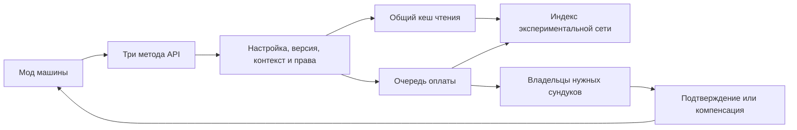

# Проект API RunicStorageNetwork

**Статус: предложение для согласования. Реализация не начата.**

Основание: RunicStorageNetwork **0.8.7**, коммит `1ca959bbc0cc4bbc1c743d8de83a02ccc68d9bb5`. Документ подготовлен по текущему коду; описанные ниже новые типы, методы, статусы и гарантии ещё не существуют в моде.

## 1. Решение, которое фиксируем

API предоставляет другим модам ровно три операции:

1. Получить список ресурсов сети — `GetResources`.
2. Получить количество конкретного ресурса — `GetResourceAmount`.
3. Списать ресурсы и получить подтверждение — `TryConsumeResources`.

Третья операция соответствует исходной идее **Give Resource**. Название уточняет направление: ресурсы списываются из сети, после чего машина может использовать подтверждённую оплату. Метод не помещает новый предмет в инвентарь машины.

**Все три операции доступны только при работающей экспериментальной функции `ExperimentalUnloadedNetworks`.** Даже если нужный сундук находится рядом, при отключённой функции API возвращает `FeatureDisabled`. Перехода на обычную систему снабжения через API нет.

API использует индекс, обнаружение удалённой сети, владельцев инвентарей и механизм списания RSN. Отдельную копию содержимого мира и отдельную систему списания не создаём. При переводе экспериментальной функции в полноценный режим публичные методы сохраняются.

Обязательные требования пользователя — три операции, зависимость от экспериментальной функции и небольшая нагрузка. Конкретные сигнатуры, рамки первой версии и численные лимиты далее являются предлагаемым решением, подлежащим утверждению.

## 2. Что уже есть в коде и чего не хватает

| Текущий код | Что можно использовать | Что нужно изменить для API |
| --- | --- | --- |
| [ResourceCatalog.cs](src/ResourceCatalog.cs) | Индекс «предмет → хранилища», версии содержимого, защита от старых записей предыдущего владельца | Дать доступ внутреннему сервису чтения без раскрытия изменяемых `Stock` наружу |
| [StorageIndex.cs](src/StorageIndex.cs), [UnloadedStorageIndex.cs](src/UnloadedStorageIndex.cs) | Обновление затронутых инвентарей, индексированная выборка, работа по потребности | Общий агрегированный снимок для сети и прав доступа; чтение без повторного обхода `core.Pool` |
| [UnloadedNetworks.cs](src/UnloadedNetworks.cs) | Каталог сохранённых объектов, поиск сети без посещения ядра, облегчённые адаптеры сундуков | Запрос от машины, ограниченная подготовка холодного каталога, учёт активных операций |
| [UnloadedMultiplayer.cs](src/UnloadedMultiplayer.cs) | Проверка запросов сервером, дозированная доставка сведений | Сейчас запрос привязан к персонажу и точке рядом с ним; нужен контекст потребителя |
| [Planner.cs](src/Planner.cs), [SourceGate.cs](src/SourceGate.cs) | План списания нескольких ресурсов, выбор меньшего числа источников, взаимное исключение | Использовать для машин совместно с обычным крафтом, не заводить независимые блокировки |
| [Transport.cs](src/Transport.cs), `InventoryDelta` в [Core.cs](src/Core.cs) | Получение свежих остатков у владельцев, списание, компенсация и повторные подтверждения | Новый вид операции; окончательный результат списания без запуска рецепта игрока |
| [TerminalTransfer.cs](src/TerminalTransfer.cs) | Пример сетевого изъятия и защиты от повторной доставки | Нельзя просто открыть `Start()` наружу: он требует игрока, кодекс и открытое окно; используется один общий `pending` |
| [Recovery.cs](src/Recovery.cs) | Квитанции результатов внутри сеанса | Для частых запросов машин нужна ограниченная память и явно определённое повторение запросов |

Дополнительные ограничения текущего кода:

- `StorageIndex.Browse()` проходит по сундукам сети и проверяет доступ. Это не готовый дешёвый публичный вызов для десятков машин каждый кадр.
- `StorageIndex.Ready()` проверяет уже известный пул. Пустой или неполный пул сам по себе не доказывает, что удалённая сеть обнаружена целиком.
- `Transport.Request()` разрешает одну активную/ожидающую операцию на участника соединения. У одного участника может быть несколько машин; этот лимит нельзя использовать как идентификатор потребителя.
- `UnloadedMultiplayer` хранит наблюдение по участнику соединения и клиентскую точку запроса. Несколько машин нельзя обслуживать перезаписью этой точки.
- `UnloadedNetworks.Prepare()` и `Request()` содержат обходы узлов/секторов. Ограничение создания адаптеров по кадрам не ограничивает автоматически стоимость этих обходов.
- Эксперимент устанавливает патчи при запуске. Настройка сейчас требует полного перезапуска и включения на сервере и клиентах; одного изменения значения в конфиге недостаточно.

## 3. Публичный контракт

Предлагаемый класс — `RunicStorageNetwork.API.NetworkResources`, версия контракта — `1`. Снимки и DTO неизменяемые, коллекции доступны только для чтения. Объект наблюдения за оплатой меняется внутри API, но потребитель не может изменять его состояние. Публичных операций ровно три; отдельные методы подключения, регистрации, резервирования, подтверждения и отмены в v1 не требуются.

```csharp
ResourceSnapshot GetResources(ApiContext context);

ResourceAmountResult GetResourceAmount(
    ApiContext context,
    ResourceKey resource);

ConsumeOperation TryConsumeResources(
    ApiContext context,
    ConsumeRequest request,
    Action<ConsumeResult> completed = null);
```

Это эскиз контракта, не готовый к компиляции пример. `ConsumeOperation` — объект наблюдения за одной операцией, а не четвёртая точка входа в API.

### Контекст потребителя

`ApiContext` содержит идентификатор сетевого объекта машины (`ConsumerId`, ZDOID) и идентификатор интеграции (`ModId`, GUID плагина BepInEx). Потребитель не передаёт произвольную позицию, имя сети, список сундуков или игрока, от чьего имени можно списывать.

Сервер самостоятельно получает позицию, владельца сетевого объекта и создателя постройки. Сеть выбирается по покрытию в позиции машины по общим правилам RSN; название сети остаётся декоративным.

Предлагаемая рамка v1: неподвижная постройка с `Piece` и `ZNetView`, размещённая игроком. Все три метода вызывает текущий владелец её сетевого объекта. Для автоматической работы права доступа определяются создателем постройки, которого сервер читает из ZDO. Получение прав произвольного онлайн-игрока не допускается. `ModId` служит для адресации и диагностики, а не является доказательством прав.

Постройка должна быть явно объявлена потребителем: интеграция добавляет к её prefab небольшой компонент-маркер с `ModId`, без собственного `Update`. Такой же prefab/маркер должен существовать у сервера. Проверка сочетания маркера, сетевого владельца и создателя необходима: одно лишь владение ZDO произвольной чужой постройки не даёт права использовать её создателя как доверенное лицо. Установка совместимой машины означает разрешение на автоматическое снабжение этой машины. Маркер — декларация при регистрации prefab средствами чужого мода, а не четвёртый метод API; передача одного `ModId` в запросе его не заменяет.

Проверяем права у машины, узлов маршрута и выбранных сундуков, включая существующие правила RSN и проверки доступа контейнеров. `NotOwner`, `AccessDenied` и `UnsupportedConsumer` различаются. Поддержку переносных устройств, персонажей и специальных машин без `Piece` можно обсудить отдельно; она не возникает автоматически из этого контракта.

### Идентификация ресурса

`ResourceKey` = `PrefabName` + `Quality`. Пример: `Wood`, качество `1`. Локализованное название, категория предмета и позиция стака не используются как ключ.

В v1 качество точное, по умолчанию `1`. Список показывает разные качества отдельно. Результат количества использует `long`, чтобы большой общий остаток не переполнял `int`. Количество в одной строке списания — положительный `int` в пределах проверенного лимита.

API работает с теми предметами и контейнерами, которые допускает общий индекс RSN; нового списка категорий ресурсов не вводим. Различия в произвольных данных предметов, зачарованиях и состоянии не являются частью ключа v1: операция предназначена для оплаты ресурсами, а не для выбора и передачи конкретного уникального экземпляра. Интеграция, которой важны такие различия, не должна использовать этот контракт для них.

## 4. Условия доступности

Публичные типы существуют и при выключенной функции, чтобы другой мод мог получить нормальный ответ. Рабочие очереди и обработка запросов API запускаются только при фактической активации эксперимента.

Перед обслуживанием проверяем:

1. Эксперимент не отключён в действующей конфигурации; выключенный режим даёт `FeatureDisabled` ещё до планирования любых работ.
2. Мир и сетевой сеанс готовы, эксперимент установлен и успешно инициализирован; проверка не ограничивается сырым значением конфига. Идущая инициализация даёт `NotReady`, её окончательная ошибка — `Unavailable`.
3. Сервер подтвердил поддержку API v1 и включённую функцию. До подтверждения — `NotReady`, а не предположение, что сервер готов.
4. Обычное снабжение RSN включено и мод исправен.
5. Машина и инициатор соответствуют условиям доступа.

У владельцев задействованных сундуков также должна быть совместимая версия протокола. Несовместимость даёт `IncompatibleVersion` до нового списания. API не включает эксперимент автоматически и не меняет его конфиг.

Отключение запрещает новые операции. Завершение/компенсация уже начатой оплаты является обязанностью протокола: нельзя бросить блокировки или признать списанную оплату несостоявшейся из-за изменения настройки. Поддержку горячего снятия экспериментальных патчей в v1 не добавляем.

## 5. GetResources: список без резервирования

Результат `ResourceSnapshot` содержит:

- `Status` — готовность или конкретную причину недоступности;
- `SessionId` — идентификатор текущего сеанса координатора;
- `NetworkId` — непрозрачный идентификатор выбранной сети для диагностики;
- `Revision` — версия снимка в этой области доступа;
- `Age` и `IsStale` — возраст и признак устаревания;
- `Resources` — неизменяемые записи `PrefabName`, `Quality`, `Amount`.

На готовом кеше вызов только проверяет дешёвые условия и возвращает сохранённый снимок. Он не читает все `Inventory`, не сериализует ZDO, не резервирует сундуки и не создаёт новый список при неизменившейся версии.

При первом обращении API ставит объединённую задачу обнаружения/подготовки в очередь и возвращает `NotReady`. Повторные обращения не добавляют копии этой задачи. Если предыдущий полный снимок уже есть, при обновлении допускается `Updating` с этим снимком и `IsStale=true`. До завершения нового прохода частичный результат не объявляется полным.

`Ready` означает полный известный снимок доступной сети, а не бронь ресурсов и не синхронное подтверждение каждого владельца. Отдельный игрок всё ещё может изменить сундук сразу после чтения.

Условие полноты включает завершение обнаружения сети для текущей версии топологии, получение требуемых записей и подготовку содержимого допустимых источников. Неизвестный сундук не равен сундуку с нулевым количеством. Известные исключённые/недоступные по правам источники не входят в область выдачи.

## 6. GetResourceAmount: адресное чтение

Использует ту же область доступа, `SessionId` и правила готовности. Для прогретого агрегата количество ищется по ключу, без построения полного списка и без перечисления всех сундуков.

| Ситуация | Ответ |
| --- | --- |
| Известный предмет есть в сети | `Ready`, его количество |
| Известный предмет отсутствует в полном снимке | `Ready`, `Amount=0` |
| Такого prefab-предмета игра не знает | `UnknownItem`, количество неизвестно |
| Снимок ещё не готов | `NotReady`, количество неизвестно |
| Есть старое значение, обновление идёт | `Updating`, последнее значение и `IsStale=true` |
| Эксперимент выключен | `FeatureDisabled`, количество неизвестно |
| Сети в точке машины нет | `NoNetwork`, количество неизвестно |

В типе результата количество допускает отсутствие значения (`long?`). Ошибка, неполная загрузка и нулевой остаток не смешиваются. Это справочная операция; она не даёт разрешения начать производство.

## 7. TryConsumeResources: подтверждённая оплата

### Запрос и результат

`ConsumeRequest` содержит `SessionId`, монотонный `Sequence` цикла машины и список `ResourceKey + Amount`. Ключ операции: `(SessionId, ConsumerId, ModId, Sequence)`; для RPC существующего транспорта из него создаётся внутренний ID.

`SessionId` впервые получается из любого метода чтения после подтверждения сеанса. Для оплаты конкретного ресурса не требуется предварительно запрашивать полный список. Предварительная проверка количества не является условием достоверности оплаты: метод сам перепроверяет запрошенное количество.

Одна строка позволяет забрать один ресурс. Несколько строк позволяют оплатить рецепт одной операцией: например, `Wood ×10` и `Iron ×2`. Повторяющиеся ключи объединяются до планирования с проверкой переполнения. Предлагаемый стартовый предел — 32 различных ключа и до 100 000 единиц на ключ, в соответствии с текущими ограничениями планировщика. Лимит числа источников одного списания остаётся отдельным от размера всей сети.

Метод возвращает `ConsumeOperation` немедленно. У него есть `RequestId`, `State`, `IsFinal` и итоговый `Result`; свойства доступны только для чтения. Метод не блокирует игровой поток. Необязательный `completed` вызывается на основном потоке, один раз для данного подписанного обработчика при окончательном результате. При обычной задержке подтверждений операция остаётся `Pending`/`Recovering`, а обработчик ещё не вызывается.

`Success` означает: всё указанное количество оплачено, координатор зафиксировал окончательный результат в текущем сеансе и больше не будет автоматически возвращать эту оплату. В ответ входят ID операции, сеть оплаты и фактически подтверждённые количества.

Подтверждённый отказ означает отсутствие оставшегося списания: либо оно не начиналось, либо компенсация подтверждена. Для потери сеанса до разрешения спорной оплаты существует отдельный `OutcomeUnknown`. Он не разрешает производство или новую попытку оплаты этого же цикла с новым ID.

### Порядок обработки

1. Проверить повторный запрос, контекст, эксперимент и лимиты. Повтор операции не создаёт новую оплату.
2. Сервер выбирает сеть по машине и по индексу находит подходящие источники. Клиенту не требуется присылать план или копию сундуков.
3. Поставить операцию в ограниченную очередь. Для конфликтующих источников используется тот же `SourceGate`, что у крафта и кодекса.
4. Запросить у владельцев выбранных сундуков свежие остатки и короткое резервирование. Повторно проверить разрешения, идентичность машины и владельцев.
5. Построить окончательный план. Если индекс устарел, обновить затронутые записи и ограниченно перепланировать по другим кандидатам. Не начинать бесконечный обход всех сундуков в одном кадре.
6. Если всего набора не хватает — освободить резервы и вернуть `InsufficientResources` с недостающими количествами.
7. Списать через существующий `InventoryDelta` на владельцах и сохранить инвентари. Дождаться подтверждений всех частей оплаты.
8. Зафиксировать единственный исход `Committed` на координаторе, сохранить квитанцию, обновить индекс, отправить результат и освободить резервы. Задержка освобождения сама по себе не отменяет уже подтверждённую оплату.
9. При сбое до окончательного `Committed` компенсировать только снятые этой операцией количества. Отказ становится окончательным после подтверждения компенсации; до этого состояние остаётся неопределённым/восстанавливаемым.

Выбранная сеть закрепляется за операцией. Восстановление пути внутри неё допустимо; после начала оплаты нельзя молча переключить тот же запрос на другую сеть. Новое подключение учитывается при следующем самостоятельном запросе после определённого исхода предыдущего.

«Весь набор или ничего» относится к окончательному результату, а не к одновременному изменению нескольких распределённых инвентарей. Во время обработки части оплаты могут быть уже сняты; они защищены резервированием и, при отказе, компенсируются.

Исчезновение машины, смена её создателя/прав или потеря маршрута до окончательного подтверждения приводят к безопасному отказу/компенсации. После `Committed` ответ переотправляется без повторного списания и без возврата по тайм-ауту. Сбой обработчика чужого мода после `Success` не отменяет оплату.

**Отличие от нынешнего крафта:** API не ждёт, пока чужой мод сообщит об изготовлении предмета. Его обязанность — оплатить ресурсы, а не атомарно выполнить произвольный код другой машины. Текущую цепочку `ready → выполнение рецепта → finish` нельзя копировать в API без изменения этой семантики.

## 8. Повторы и смена владельца

Для одного потребителя разрешена одна незавершённая оплата. Другие машины того же клиента/сервера могут работать параллельно в пределах общего бюджета.

- Один ключ операции с тем же нормализованным запросом возвращает текущую операцию или её прежнюю квитанцию.
- Повторные обращения не добавляют неограниченное число обработчиков: одинаковая подписка объединяется, а число наблюдателей операции ограничено. Сетевой повтор не означает повторный запуск обработчика результата.
- Тот же ключ с другими ресурсами/количествами — `RequestConflict`, без новой оплаты.
- Новый `Sequence` при незавершённой предыдущей операции — `Busy`; это отказ принять новую операцию, а не исход предыдущей.
- Последний результат хранится, пока не принят следующий цикл. Для старых последовательностей хранится отметка уже обработанного номера: они не могут повторно списать ресурсы, даже когда подробная квитанция удалена. Ответ для такого номера — `ExpiredRequest`, а не успешная новая попытка.
- Номера должны возрастать; переполнение запрещено. Для неизвестного потребителя первый номер устанавливает начало последовательности после проверки контекста.
- В течение сеанса смена владельца машины не меняет её ZDOID и не создаёт новый ключ оплаты. Новый владелец может продолжить только тот же незавершённый цикл. Старый владелец больше не может инициировать новую оплату.
- Мод-потребитель сохраняет номер незавершённого цикла и факт применения результата в сетевом состоянии машины. Один `Success` не должен дважды увеличить внутренний запас или дважды запустить производство.

Подробные завершённые квитанции и кеш чтения можно вытеснять. Компактные отметки обработанных номеров нельзя молча забывать в текущем сеансе. Их учёт ограничивается отдельным пределом числа потребителей; при его достижении новые потребители получают `CapacityExceeded`, а существующая защита не отключается. Уничтоженные ID также не переиспользуются. Это даёт ограниченную память без TTL, после которого старый запрос внезапно становится новой оплатой.

### Граница надёжности

Существующий мод не имеет долговечного журнала распределённых транзакций. В v1 API предлагаем гарантии повторов и компенсации **в пределах живого сеанса**, но не обещаем атомарность между сохранениями разных сундуков и состоянием сторонней машины при аварийном завершении сервера.

Новый серверный сеанс получает новый `SessionId`. Старый спорный запрос нельзя автоматически перевыполнить под новым ID; он требует выяснения результата. Обработчик может получить `OutcomeUnknown` при потере сеанса. Надёжное восстановление после аварии потребует отдельного журнала и согласования сохранения результатов с модом-потребителем. Это самостоятельное расширение, которое не скрываем под обещанием «всегда возвращает true/false».

## 9. Сеть и нагрузка



Координатор — сервер, но ему не требуется игрок-хост рядом с ядром. Для незагруженных сундуков он использует существующие облегчённые адаптеры. Для загруженных сундуков учитывает реального владельца и запрашивает подтверждение у него. API не редактирует чужой сохранённый инвентарь напрямую в обход владельца.

Для API клиентам достаточно агрегированных количеств и ответов на оплату. Не нужно передавать каждой машине полные ZDO всех сундуков. Предлагаются отдельные сообщения API v1 поверх существующего транспорта: контекст потребителя, запрос снимка/количества, запрос оплаты и ответы. Внутреннее RPC не увеличивает число публичных методов.

Кеш делится по сеансу, выбранной сети и области прав, а не копируется для каждой машины. Его актуальность зависит от версий содержимого, топологии, настроек контейнеров и доступа. Разные права нельзя объединять только по имени сети. После смены владельца или удаления объекта старые ответы проверяются по версии/поколению и отбрасываются.

Принципы ограничения нагрузки:

- После прогрева — поиск количества по словарю; повторная выдача неизменившегося списка без новой коллекции. Это целевой режим, не уже измеренная характеристика.
- Первый большой список подготавливается частями, а не целиком внутри `GetResources`. Обход узлов, проверка доступа и агрегация также входят в бюджет.
- Один потребитель не создаёт копии одинакового ожидающего запроса. Запросы одной области чтения объединяются; ответ отправляется по изменению версии или при необходимом обновлении.
- Топология и события изменения обновляют затронутые записи. Для пропущенных уведомлений/динамических прав остаётся ограниченная сверка по обращению; кеш не объявляется вечно верным.
- Потребность машины имеет срок жизни. После прекращения запросов её наблюдение истекает; незавершённая оплата удерживает необходимые объекты до определённого исхода.
- Истечение интереса само по себе не позволяет выгрузить занятый адаптер, сбросить владельца или удалить метку оплаты. Очистка учитывает обычные запросы игрока и общие резервы.
- Квоты задаются глобально и на участника соединения; множество `ModId` не обходит ограничения. Очереди обходятся справедливо, а API не должен вытеснять обычный крафт.
- Все обращения к Unity и инвентарям выполняются на основном потоке. Фоновые потоки для обхода игровых объектов не создаются.

Начальные ориентиры для прототипа: до 32 ключей в оплате, одна незавершённая операция на потребителя, до 256 принятых операций суммарно, до 32 активных операций одного участника; повторная проверка неизменившегося контекста/снимка по обращению — не чаще раза в секунду. Число одновременно кешируемых областей и компактных отметок потребителей также имеет фиксированный предел с явным отказом, а не бесконтрольным ростом памяти. Конкретные значения этих двух пределов выбираются после замера размера записей.

Для новой работы API начальная цель — мягкий общий бюджет около 0,5 мс на кадр; существующие бюджеты индекса не умножаются на число машин. Проверять время нужно между небольшими единицами работы. Один вызов игрового `Inventory.Load/Save` или чужого обработчика нельзя принудительно прервать, поэтому это не обещание жёсткого максимума времени кадра.

## 10. Рамки первой версии

API обеспечивает доступ к удалённым хранилищам для работающей машины. Оно не запускает производственную логику самой машины, если та выгружена и её мод не выполняет код. Постоянная работа любых чужих станков без игроков — отдельная задача.

Ресурсы списываются только из сети, без участия инвентаря игрока. Открытый кодекс, меню крафта и присутствие игрока рядом с машиной не нужны. Сама машина для v1 должна соответствовать контексту и иметь действующего владельца сетевого объекта.

Передача готовых `ItemData`, складывание ресурсов обратно, выбор конкретного зачарованного экземпляра, публичное резервирование и пользовательские окна не входят в эти три операции. API возвращает структурированные статусы; сообщения на HUD не создаёт. Журналирование задержек/ошибок ограничивается по частоте и содержит ID операции, интеграции и потребителя.

Подключение для других модов: ссылка на установленную `RunicStorageNetwork.dll` как compile-time dependency и зависимость BepInEx при использовании API. Копию нашей DLL в пакет чужого мода не включают. Дополнительные сервисы, SDK-процесс или NuGet-пакеты для исполнения не нужны. Текущую цель `net472` сохраняем; стабильным считаем только пространство имён API, а не существующие публичные вспомогательные классы.

## 11. План изменений после утверждения

| Часть | План |
| --- | --- |
| Публичный слой | Добавить три метода, неизменяемые DTO, перечисления состояний и номер контракта |
| Контекст | Проверка ZDO потребителя, владельца, создателя, позиции, прав и выбранной сети на координаторе |
| Чтение | Общие снимки и агрегаты поверх `ResourceCatalog`/`StorageIndex`; версия, полнота, ограниченная подготовка |
| Эксперимент | Отдельный спрос от потребителей; не перезаписывать наблюдения игрока; кооперативное ограничение больших обходов |
| Транспорт | Версионированный вид API-операции, общая очередь/блокировки источников и отдельные лимиты потребителей |
| Оплата | Использовать `Planner` и `InventoryDelta`; окончательная серверная квитанция списания без вызова рецепта или UI |
| Повторы | Сеанс, номера циклов, проверка содержимого повторного запроса, ограниченные квитанции и защита старых номеров |
| Интеграционный пример | Небольшой тестовый потребитель: прочитать запас и оплатить производственный цикл после подтверждения |
| Документация | Краткий английский контракт для разработчиков, статусы, пример правильной обработки `Pending` и повторов |

Общий код транзакций можно вынести во внутренние методы/адаптеры, чтобы не копировать протокол. При этом проверки игрока, рецепта, кодекса и итогового крафта сохраняют свою семантику. Машину нельзя выдавать за фиктивного игрока или маскировать под `rsn_take:`.

Предлагаемый порядок: сначала типы/проверка выключенного режима; затем кеш чтения; затем одна оплата в одиночной игре; затем мультиплеер, конкуренция и восстановление. Каждый этап проверяется до расширения. Публикация — после проверки поведения, а не только компиляции.

## 12. Проверки и критерии приёмки

| Сценарий | Ожидаемый результат |
| --- | --- |
| Эксперимент выключен локально/на сервере, даже при сундуке рядом | Все новые API-вызовы получают `FeatureDisabled`; нет запросов загрузки, резервов и изменений инвентарей |
| Мир загружается, ответ о возможностях сервера ещё не получен | `NotReady`; неизвестное состояние не превращается в пустой список |
| API/протокол не поддерживается одним из нужных участников | Контролируемая несовместимость до нового списания |
| Подставной `ModId`, чужой/устаревший владелец или постройка без маркера потребителя | Отказ в контексте; нельзя использовать произвольную постройку как разрешение доступа от её создателя |
| Вход вдали от ядра, которое ещё не посещали | Обнаружение по сохранённым данным; затем полный снимок и успешная оплата |
| Пустая сеть, неизвестный ID, частично прочитанная сеть | Три различимых ответа; `Ready + 0` только для известного предмета в полном снимке |
| Повторное чтение одной сети 50 машинами | Общий кеш, отсутствие повторной десериализации и резервирования |
| Добавление/изъятие предметов, изменение разрешений и фильтров | Обновление затронутых данных; окончательная оплата заново проверяет доступ |
| Одновременный крафт игрока, кодекс и несколько машин | Общие блокировки и справедливая очередь; ни двойного списания, ни бесконечного ожидания обычного крафта |
| Ресурсы разбросаны по сундукам | Оплачивается полный набор либо подтверждается компенсация всех снятых частей |
| Ресурс исчез между чтением и оплатой | Перепроверка/перепланирование; при нехватке подтверждённый отказ, без ложного `Success` |
| Повтор/перестановка RPC, задержка оплаты/результата/освобождения | Повтор того же ID; нет второй оплаты, нет предположительного возврата |
| Повторный ключ с изменённым содержимым, старый номер после очистки кеша | `RequestConflict`/`ExpiredRequest`, без списания |
| Смена владельца, телепортация, выгрузка сундука во время операции | Сохраняется одна операция; определённый успех или подтверждённая компенсация; иначе `Recovering` |
| Машина удалена до/после `Committed`, обработчик чужого мода бросает исключение | Семантика соответствует разделу 7; после окончательной оплаты нет автоматического возврата |
| Перезапуск сервера со спорной оплатой | Новый сеанс не повторяет старую оплату; неопределённость явно обозначена |
| Завершение/отказ операции и последующее разрушение сундука молотком | Резервы освобождены; сундук исчезает, ресурсы выпадают однократно; регрессия ошибки 0.8.7 не допускается |

Изолированными тестами проверяются состояния, планирование, повторы, очереди, ограничения и кеш. Реальные владение ZDO, сторонние контейнеры, MultiUserChest и выгрузка проверяются отдельно в игре: одиночный мир, выделенный сервер и минимум два клиента. Изолированные тесты не заменяют эти проверки.

Нагрузочные сценарии: 100/500/1000 сундуков, 1/10/50 машин, одна сеть и несколько независимых сетей. Сравнить выключенный API, прогретое чтение, холодную подготовку и одновременное списание. Измерять выделения памяти, повторные обходы/десериализации, число RPC, p95/p99 времени кадра и задержку обычного крафта. Числа здесь — план замеров, а не заявление о поддерживаемой производительности.

## 13. Что предлагается утвердить

1. Три метода с предложенными названиями; `TryConsumeResources` принимает один ресурс или небольшой набор.
2. Жёсткая зависимость API от экспериментальной функции, без обходного режима.
3. Чтение — справочные снимки без резервирования; разрешение на использование даёт только подтверждённая оплата.
4. Первая версия — для неподвижных сетевых машин, построенных игроком; права по создателю, вызовы от действующего владельца.
5. Общий индекс и общий механизм блокировки/списания с отдельным контекстом потребителя.
6. Асинхронная оплата, защита от повторов в сеансе и отдельное состояние неопределённого результата.
7. Обязательства потребителя: сохранять цикл машины и применять квитанцию один раз; аварийная атомарность между разными модами не заявляется.
8. Реализация и публикация начинаются отдельным решением после рассмотрения этого проекта.

**Вывод:** решение реализуемо на существующей основе, но не сводится к трём публичным обёрткам над терминалом. Основная работа — безопасный контекст машины, общий кеш чтения и корректное завершение оплаты независимо от интерфейса игрока. Именно эти внутренние изменения позволяют оставить наружный API небольшим.
